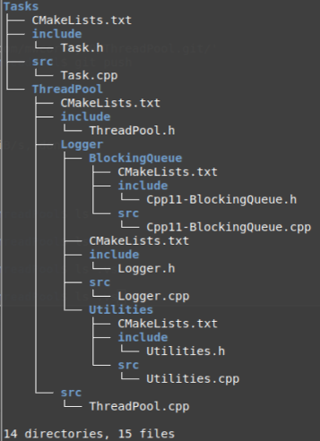

# ThreadPool
Implements threadpool and tasks that hold a static threadpool
Fork of Dr. Fawcett's C++ ThreadPool Repository (restuctured for CMake -- works on Linux currently
  Current project structure ..  

